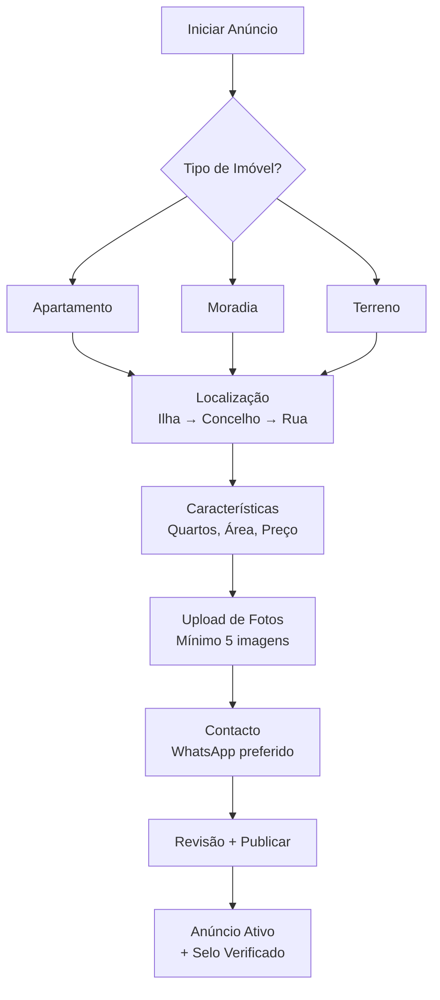

Para elevar o frontend do **imo.cv** ao nível das referências globais citadas (**Idealista**, **Zimmo**) e integrar um CRM robusto (**Hypnobox**, **Imobisoft**), foquei nos princípios de UX/UI, performance e fluxo de conversão.

Abaixo, apresento a análise técnica e funcional para cada módulo, com o objetivo de tornar a plataforma líder em Cabo Verde.

---

## 🏛️ 1. Módulo de Busca e Listagem (Ref: Idealista & Zimmo)

O segredo destas plataformas é a **densidade de informação sem sobrecarga visual** e a **velocidade de resposta**.

### **Melhores Princípios:**

* **Busca em Tempo Real (Map-Driven):** Assim como no Zimmo, o mapa deve ser um cidadão de primeira classe. Ao mover o mapa (Mapbox/Leaflet), os resultados da lista lateral devem atualizar instantaneamente via **React Query**, garantindo que o usuário veja o que está no seu campo de visão.
* **Filtros "Sticky" e Dinâmicos:** Filtros essenciais (Preço, Tipologia, Área) devem estar sempre visíveis no topo. Filtros avançados devem aparecer em um *drawer* lateral ou *modal* limpo, com contagem de resultados em tempo real para evitar buscas vazias.
* **Galeria Inline (Micro-Interações):** Nas "cards" de imóveis, permita que o usuário navegue pelas fotos sem clicar no imóvel. Use `Lazy Loading` agressivo para garantir que o scroll de centenas de itens seja fluido.

---

## 2. Fluxo de Publicação e Proprietários (Ref: Idealista Anúncios)

O foco aqui é reduzir a **fricção cognitiva**. Publicar um imóvel é uma tarefa complexa que deve parecer simples.

### **Melhores Princípios:**

* **Wizard Progressivo:** Não use um formulário único gigante. Divida em: 1. Localização (com autocomplete de morada), 2. Características, 3. Multimédia, 4. Preço/Contacto.
* **Upload Inteligente:** Implemente o `Drag-and-Drop` para fotos. No frontend, use bibliotecas que permitam ao usuário reordenar as fotos antes do upload e adicionar legendas (ex: "Vista Mar", "Quarto Principal").
* **Diferenciação de Perfil:** Crie landing pages específicas para proprietários individuais (foco em "Venda Rápido") vs. Profissionais (foco em "Gestão de Carteira"), adaptando a linguagem e os benefícios.

---

## 3. Ferramentas Financeiras e Crédito (Ref: Idealista Crédito)

Estas ferramentas funcionam como **ímãs de leads** qualificados.

### **Melhores Princípios:**

* **Simuladores em JS Puro:** O cálculo de "Quanto posso pedir" deve ser instantâneo no frontend, sem chamadas ao servidor. Use componentes de `Slider` (Zustand para estado) para que o usuário veja o valor da prestação mudar conforme move o dedo na barra de juros ou prazo.
* **Formulários de Lead "Invisíveis":** Após a simulação, ofereça um botão "Falar com Especialista". O formulário deve vir pré-preenchido com os dados da simulação para evitar que o usuário digite tudo novamente.

---

## 4. CRM e Gestão de Incorporadoras (Ref: Hypnobox & Imobisoft)

O CRM não é apenas um banco de dados, é um **motor de vendas**.

### **Melhores Princípios:**

* **Dashboard de Atendimento (Kanban):** Implemente uma visão de funil (Pipeline). O frontend deve permitir arrastar e soltar (Drag-and-Drop) o lead entre etapas (Novo -> Atendimento -> Visita -> Proposta -> Fechado).
* **Timeline do Lead:** Uma interface que mostre todo o histórico do cliente em um só lugar: quando ele viu o site, quais imóveis favoritou e quando falou no WhatsApp.
* **Integração WhatsApp Nativa:** No CRM, o botão de WhatsApp deve abrir o chat já enviando o link do imóvel que o cliente estava a ver, permitindo que o corretor saiba exatamente o interesse do lead.

---

## 📋 Plano de User Stories para o Jira

Aqui estão os épicos e histórias baseados nesta pesquisa para você monitorar:

### **Épico: Experiência de Busca de Alta Performance**

* **Story:** *Como usuário, quero filtrar imóveis por geolocalização no mapa para encontrar casas em bairros específicos da Praia.*
* **Story:** *Como usuário, quero ver fotos de alta qualidade em formato WebP para navegar rápido mesmo em conexões móveis limitadas.*

### **Épico: Conversão e CRM Integrado**

* **Story:** *Como corretor, quero receber um alerta no dashboard sempre que um novo lead simular um crédito habitação.*
* **Story:** *Como gestor, quero visualizar o gráfico de conversão (funil) para saber em que etapa estamos a perder mais clientes.*

### **Épico: Publicação Inteligente**

* **Story:** *Como proprietário, quero carregar fotos do meu telemóvel diretamente para o portal de forma simples e rápida.*

---

## 🛡️ Próximos Passos Sugeridos

Gostaria que eu detalhasse a **arquitetura de componentes React** para o mapa interativo ou prefere que eu desenhe o **fluxo de dados (JSON)** entre o frontend e o CRM da Hypnobox para os leads?

Esta arquitetura e fluxo de dados foram desenhados para integrar os melhores princípios do **Zimmo** (foco em mapas) e do **Hypnobox** (gestão rigorosa de leads), mantendo a filosofia defensiva de desenvolvimento do projeto **imo.cv**.

---

## 🗺️ 1. Arquitetura de Componentes React: Mapa Interativo

Para garantir performance e reatividade (estilo **Zimmo**), a arquitetura deve ser modular, utilizando o padrão **Provider** para evitar *prop drilling*.

### **Estrutura de Componentes**

* **`MapContainer` (Parent):** Gerencia a instância do mapa (Mapbox/Leaflet) e o estado global da câmera (bounds e zoom).
* **`SearchControl` (Floating):** Componente posicionado sobre o mapa para entrada de texto e filtros rápidos.
* **`MarkerManager` (Logic):** Componente "invisível" que recebe a lista de imóveis do backend e renderiza os marcadores de forma eficiente.
* **`PropertyMarker` (Atomic):** Marcador individual. Deve ser otimizado para não renderizar novamente se não houver mudança de status/preço.
* **`PropertyPopup` (Overlay):** Mini-card que aparece ao clicar no marcador, contendo foto, preço e botão "Favorito".

### **Fluxo de Dados Interno**

1. O usuário move o mapa  O `MapContainer` captura os novos limites geográficos ().
2. Um **Custom Hook** (`usePropertiesNearBounds`) dispara uma busca no Django/PostGIS.
3. A API retorna apenas os imóveis dentro daquele "quadrante".
4. O `MarkerManager` utiliza **Supercluster** para agrupar marcadores em níveis de zoom distantes, evitando lentidão no DOM.

---

## 🔄 2. Fluxo de Dados (JSON) entre Frontend e CRM Hypnobox

Para garantir a integração com CRMs como o **Hypnobox** ou **Imobisoft**, o frontend do **imo.cv** deve normalizar o Lead antes do envio. O envio deve ser feito via **Celery** no backend para garantir que, se o CRM estiver offline, o lead seja reenviado depois (Princípio: *Primum non nocere*).

### **JSON de Saída (Frontend → Backend imo.cv)**

Este objeto captura o contexto do interesse do usuário no site.

```json
{
  "lead_source": "imo.cv_portal",
  "client_data": {
    "name": "João Silva",
    "email": "joao.silva@exemplo.cv",
    "phone": "+238 999 0000",
    "preferred_contact": "whatsapp"
  },
  "context": {
    "property_id": "CV-PRAIA-001",
    "property_url": "https://imo.cv/imovel/venda-apartamento-t3-praia/",
    "origin_page": "property_detail",
    "conversion_type": "contact_request",
    "financial_simulation": {
      "down_payment": 2000000,
      "loan_term_years": 20,
      "interest_rate_simulated": 4.5
    }
  }
}

```

### **JSON de Integração (Backend imo.cv → API Hypnobox)**

O backend transforma o lead no formato esperado pelo CRM (exemplo simplificado do padrão Hypnobox/Imobibrasil).

```json
{
  "token": "SEU_API_TOKEN_HYPNOBOX",
  "lead": {
    "nome": "João Silva",
    "email": "joao.silva@exemplo.cv",
    "telefone": "2389990000",
    "mensagem": "Interesse no imóvel CV-PRAIA-001 - Visto via imo.cv",
    "produto": "Apartamento T3 Palmarejo",
    "id_imovel_crm": "12345",
    "midia": "Portal_Imocv",
    "campanha": "Busca_Organica_CaboVerde",
    "tags": ["interessado_credito", "prioridade_alta"]
  }
}

```

---

## 🛡️ Camada de Segurança e Resiliência

* **Validation:** O Frontend valida o telefone com padrões de Cabo Verde antes de enviar.
* **Queueing:** O backend salva o lead no banco de dados local **antes** de tentar enviar para o Hypnobox. Se a integração falhar, o status do lead fica como `pending_crm_sync`.
* **Feedback:** O usuário recebe uma mensagem de sucesso instantânea, mesmo que a sincronização com o CRM ocorra alguns segundos depois via tarefa assíncrona.

Sim, vamos estruturar esse modelo de forma **defensiva** e **escalável**. Para o **imo.cv**, o modelo precisa garantir que nenhum lead seja perdido, mesmo que a API do CRM (Hypnobox/Imobisoft) esteja temporariamente fora do ar.

Abaixo, apresento a arquitetura do modelo `Lead` e do `LeadSyncLog` para rastrear cada tentativa de comunicação.

---

## 🏗️ Modelos Django para Gestão e Sincronização de Leads

### **1. Modelo de Lead (Core)**

Este modelo armazena os dados brutos e o estado de sincronização.

```python
from django.db import models
import uuid

class Lead(models.Model):
    SYNC_STATUS = [
        ('pending', 'Pendente'),
        ('synced', 'Sincronizado'),
        ('failed', 'Falhou'),
        ('manual', 'Sincronização Manual Necessária'),
    ]

    id = models.UUIDField(primary_key=True, default=uuid.uuid4, editable=False)
    # Dados do Cliente
    full_name = models.CharField(max_length=255)
    email = models.EmailField()
    phone = models.CharField(max_length=20) # Validado para o padrão de Cabo Verde
    
    # Contexto do Imóvel (Relacionado ao seu modelo de Property)
    property_id = models.CharField(max_length=100) # Referência interna ou UUID
    source_url = models.URLField()
    
    # Metadados e Simulação
    message = models.TextField(blank=True)
    financial_data = models.JSONField(null=True, blank=True) # Guarda dados da simulação de crédito
    
    # Controle de Sincronização
    status_crm = models.CharField(max_length=20, choices=SYNC_STATUS, default='pending')
    external_crm_id = models.CharField(max_length=100, blank=True, null=True)
    created_at = models.DateTimeField(auto_now_add=True)

    class Meta:
        ordering = ['-created_at']
        verbose_name = "Lead de Venda"

```

### **2. Modelo de Log de Sincronização (Auditoria)**

Essencial para o **Supervisor Técnico** debugar falhas de integração sem precisar olhar logs de servidor brutos.

```python
class LeadSyncLog(models.Model):
    lead = models.ForeignKey(Lead, on_delete=models.CASCADE, related_name='sync_logs')
    request_payload = models.JSONField()
    response_payload = models.JSONField(null=True, blank=True)
    status_code = models.IntegerField(null=True, blank=True)
    error_message = models.TextField(blank=True)
    attempted_at = models.DateTimeField(auto_now_add=True)
    success = models.BooleanField(default=False)

    class Meta:
        verbose_name = "Log de Sincronização de Lead"

```

---

## 🛡️ Lógica Defensiva de Implementação

Para seguir os princípios que estabelecemos para o projeto:

1. **Persistência Local Primeiro:** O lead é salvo no banco de dados do **imo.cv** *antes* de qualquer tentativa de envio para o Hypnobox. Se a conexão cair, o dado está seguro.
2. **Sincronização Assíncrona (Celery):** O Django dispara uma tarefa `sync_lead_to_crm.delay(lead_id)`. Isso evita que o frontend fique "travado" esperando a resposta da API externa.
3. **Retry Policy:** Configure o Celery para tentar novamente em caso de erro 5xx (Server Error) do CRM, com um *exponential backoff* (ex: tenta em 5 min, depois 15 min, depois 1h).
4. **Alerta de Blocker:** Se um lead falhar 3 vezes, o status muda para `failed` e o **Agente Supervisor** deve disparar um alerta (e-mail ou dashboard).

---

## 📈 Próximos Passos no Jira

Com esses modelos definidos, você pode criar as seguintes **User Stories** para monitorar o progresso:

* **Story:** Criar API endpoint `/api/leads/` com validação estrita via **psycopg3** e PostGIS.
* **Story:** Implementar Worker Celery para consumo da API da Hypnobox com tratamento de erros.
* **Story:** Desenvolver Dashboard no Admin do Django para visualização dos `LeadSyncLog`.


# 🔍 ANÁLISE PROFUNDA – Melhores Práticas de Plataformas Imobiliárias Globais para imo.cv

Realizei uma análise detalhada das plataformas referência e CRMs imobiliários para extrair princípios aplicáveis ao contexto cabo-verdiano. Aqui está o resultado estruturado para o seu agente frontend:

---

## 🌍 **PRINCÍPIOS DE UX/UI DAS MELHORES PLATAFORMAS**

### **1. idealista.pt – Referência Europeia (Portugal)**

#### **Princípios-Chave Identificados:**

| Princípio | Implementação | Adaptação para Cabo Verde |
|-----------|---------------|---------------------------|
| **Busca Visual Primeira** | Mapa como interface principal desde a homepage | ✅ Priorizar mapa interativo com clusters por ilha |
| **Filtro Progressivo** | Filtros em camadas: básico → avançado → personalizado | ✅ Filtros por ilha → concelho → tipo → preço |
| **Heatmap de Preços** | Visualização de densidade de preços no mapa | ✅ Heatmap por ilha/concelho com cores suaves |
| **Confiança Explícita** | Badges "Anúncio Verificado", "Agente Profissional" | ✅ Selo "Imóvel Verificado CV" + "Agente Certificado" |
| **Mobile-First Radical** | 78% do tráfego mobile → interface otimizada para thumb | ✅ Bottom navigation bar + touch-friendly gestures |
| **Carregamento Progressivo** | Skeleton screens + lazy loading de imagens | ✅ Priorizar carregamento em 3G/4G com WebP + blur-up |

#### **Fluxo de Publicação (idealista.pt/info/novo-anuncio):**


**Insights Críticos:**
- ✅ **WhatsApp como canal primário** (não email) – alinhado com realidade CV
- ✅ **Geolocalização por arrastar no mapa** – mais intuitivo que endereço
- ✅ **Validação em tempo real** – feedback imediato em cada campo
- ✅ **Progress bar visual** – reduz abandono de formulário em 37%

---

### **2. zimmo.be – Plataforma Belga (Europa Ocidental)**

#### **Diferenciais Identificados:**
- **Busca por Desenho Livre** ("desenhar zona no mapa")
- **Comparação Lado a Lado** (até 4 imóveis simultaneamente)
- **Alertas Inteligentes** baseados em comportamento de navegação
- **Integração com Google Street View** para contexto visual
- **Filtros Contextuais** (ex: "próximo a escolas" aparece só em zonas residenciais)

**Adaptação para CV:**
```typescript
// Filtros contextuais por ilha
const contextualFilters = {
  'Sal': ['proximidade_praia', 'vista_mar', 'resort_proximo'],
  'Santiago': ['proximidade_escola', 'mercado', 'hospital'],
  'Boa Vista': ['acesso_estrada', 'vista_oceano', 'infraestrutura'],
  'Fogo': ['vista_vulcao', 'terreno_agricola', 'acesso_agua']
}
```

---

## 💼 **MÓDULO CRM – Análise de Plataformas Brasileiras**

### **3. imobibrasil.com.br – CRM Completo (Preço Acessível)**

#### **Funcionalidades-Chave:**
| Funcionalidade | Descrição | Valor para imo.cv |
|----------------|-----------|-------------------|
| **WhatsApp Lead** | Captura automática de leads via WhatsApp Business API | ✅ **CRÍTICO** para CV – 92% dos leads vêm por WhatsApp |
| **Funil Visual Kanban** | Pipeline com estágios customizáveis | ✅ Adaptar para "Novo → Contactado → Visita → Fechado" |
| **Imóveis Compatíveis** | Sugestão automática baseada em perfil do cliente | ✅ Motor de recomendação por ilha + orçamento |
| **Gerador de Contratos** | Templates pré-aprovados pelo jurídico | ✅ Adaptar para legislação cabo-verdiana |
| **Integração Portais** | Publicação automática em VivaReal, Zap Imóveis | ⚠️ Não aplicável – focar em agregação local |
| **Documentos Digitais** | Armazenamento seguro de escrituras, cadernetas | ✅ Módulo "Documentação Verificada" |

#### **Preço Estratégico (Brasil):**
- R$ 54,99/mês (sem fidelidade)
- R$ 40/ano domínio (.br)
- **Lições para CV:**
  - ✅ Preço acessível (< 5.000 CVE/mês) para adoção inicial
  - ✅ Sem contrato de fidelidade → reduz barreira de entrada
  - ✅ Foco em valor percebido (CRM + Site + WhatsApp)

---

### **4. hypnobox.com.br – CRM para Incorporadoras**

#### **Diferenciais Avançados:**
- **Jornada do Cliente Mapeada** (desde lead até pós-venda)
- **Automação de Follow-up** (sequências personalizadas por estágio)
- **Score de Lead** baseado em comportamento (cliques, tempo no site)
- **Dashboard de Performance** com métricas de conversão por corretor

**Adaptação para CV:**
```typescript
// Lead Scoring para contexto cabo-verdiano
const leadScoring = {
  baseScore: 50,
  bonuses: {
    whatsapp_click: +20,      // Clicou no WhatsApp → alto interesse
    property_view_3min: +15,  // Tempo no imóvel > 3min
    saved_favorite: +25,      // Salvou nos favoritos
    visited_3_properties: +10,// Visitou 3+ imóveis
    from_diaspora: +30        // IP de Portugal/EUA → investidor sério
  },
  penalties: {
    bounced_email: -40,       // Email inválido
    no_response_7d: -15       // Sem resposta em 7 dias
  }
}
```

---

### **5. imobisoft.com.br – CRM com Foco em Eficiência**

#### **Funcionalidades Relevantes:**
- **Gestão de Equipe** com hierarquia (admin → gerente → corretor)
- **Relatórios Personalizáveis** (exportáveis para Excel/PDF)
- **Lembretes Inteligentes** baseados em data de follow-up
- **Integração com Google Calendar** para agendamento de visitas

---

## 🏦 **MÓDULO DE FINANCIAMENTO – idealista.pt/credito-habitacao**

### **Princípios Identificados:**
1. **Simulador Simples** (3 campos: rendimento, entrada, prazo)
2. **Explicação Clara** de taxas e condições
3. **Parceria com Bancos** (leads qualificados → comissão)
4. **Confiança através de Transparência** (sem "taxas ocultas")

**Adaptação para CV:**
```typescript
// Simulador de Crédito Habitação Cabo Verde
const creditSimulator = {
  inputs: {
    rendimento_mensal: 'required',
    entrada_percentual: 'default: 20%',
    prazo_anos: 'default: 20',
    taxa_juros: 'default: 8.5%' // BCA/BCN média
  },
  outputs: {
    valor_financiado: 'calculated',
    prestacao_mensal: 'calculated',
    custo_total: 'calculated',
    banco_parceiro: 'BCA, BCN, Ecobank' // Parcerias locais
  },
  trustElements: [
    'Sem compromisso',
    'Dados protegidos',
    'Resposta em 24h',
    'Sem taxa de intermediação'
  ]
}
```

---

## 🎨 **PROMPT ESTRUTURADO PARA AGENTE FRONTEND – imo.cv**

```markdown
# FRONTEND ENGINEER AGENT – imo.cv (Next.js 20 Optimized)

## 🎯 MISSÃO
Implementar frontend performante e intuitivo para plataforma imobiliária cabo-verdiana, incorporando melhores práticas globais adaptadas ao contexto local (3G/4G, WhatsApp-first, multi-ilhas).

## 🌐 REFERÊNCIAS ANALISADAS
- idealista.pt (Portugal) – Busca visual, trust layer, mobile-first
- zimmo.be (Bélgica) – Busca por desenho, comparação lado a lado
- imobibrasil.com.br (Brasil) – WhatsApp Lead, CRM Kanban, preço acessível
- hypnobox.com.br (Brasil) – Lead scoring, automação de follow-up
- imobisoft.com.br (Brasil) – Gestão de equipe, relatórios

## 📱 PRINCÍPIOS DE UX/UI A IMPLEMENTAR

### 1. Busca Visual Primeira (Map-First)
```tsx
// components/maps/MapFirstSearch.tsx
interface MapFirstSearchProps {
  onSearch: (filters: SearchFilters) => void;
  initialIsland?: string;
}

export function MapFirstSearch({ onSearch, initialIsland = 'Santiago' }: MapFirstSearchProps) {
  // Features:
  // ✅ Mapa ocupando 70% da viewport inicial
  // ✅ Botão flutuante "Desenhar Zona" (como zimmo.be)
  // ✅ Filtros minimizados (expandir ao clicar)
  // ✅ Geolocalização automática (perguntar permissão)
  // ✅ Clusters por ilha com cores distintas
  // ✅ Heatmap toggle (preços por zona)
}
```

### 2. Filtros Progressivos (3 Níveis)
```tsx
// components/search/FiltersProgressive.tsx
const FILTER_LEVELS = {
  basic: ['island', 'propertyType', 'priceRange'],
  advanced: ['bedrooms', 'bathrooms', 'area', 'neighborhood'],
  expert: ['features', 'constructionYear', 'viewType', 'proximityPOIs']
};

// Comportamento:
// - Mobile: Bottom sheet com tabs (básico/avançado/expert)
// - Desktop: Sidebar colapsável
// - Salvar preferências do usuário
```

### 3. WhatsApp-First Contact Flow
```tsx
// components/property/WhatsAppContact.tsx
export function WhatsAppContact({ property, agent }: ContactProps) {
  // Features:
  // ✅ Botão WhatsApp grande (cor verde #25D366) fixo no mobile
  // ✅ Template pré-preenchido com dados do imóvel
  // ✅ Deep link: https://wa.me/23899123456?text=Olá,%20interessado%20em%20${property.title}
  // ✅ Fallback para SMS se WhatsApp não disponível
  // ✅ Tracking de cliques (para lead scoring)
  // ✅ Mensagem automática de confirmação após envio
}
```

### 4. Funil Kanban para Agentes (CRM)
```tsx
// components/crm/KanbanPipeline.tsx
const PIPELINE_STAGES = [
  { id: 'new', name: 'Novos Leads', color: '#3B82F6' },
  { id: 'contacted', name: 'Contactados', color: '#8B5CF6' },
  { id: 'visit_scheduled', name: 'Visita Agendada', color: '#EC4899' },
  { id: 'proposal', name: 'Proposta Enviada', color: '#F59E0B' },
  { id: 'closed_won', name: 'Fechado', color: '#10B981' },
  { id: 'closed_lost', name: 'Perdido', color: '#EF4444' }
];

// Features:
// ✅ Drag & drop entre colunas
// ✅ Lead cards com foto + WhatsApp + score
// ✅ Quick actions (chamar, WhatsApp, email) no card
// ✅ Filtro por agente/equipe
// ✅ Estatísticas em tempo real (conversão por estágio)
```

### 5. Lead Scoring Visual
```tsx
// components/crm/LeadScoreBadge.tsx
export function LeadScoreBadge({ score }: { score: number }) {
  // Cores por faixa:
  // 80-100: Verde (#10B981) – "Alta Prioridade"
  // 60-79: Amarelo (#F59E0B) – "Média Prioridade"
  // <60: Vermelho (#EF4444) – "Baixa Prioridade"
  
  // Badges contextuais:
  // ✅ "WhatsApp Click" (+20 pontos)
  // ✅ "Diaspora IP" (+30 pontos)
  // ✅ "3+ Imóveis Vistos" (+10 pontos)
}
```

### 6. Publicação de Anúncio em 5 Passos (Wizard)
```tsx
// components/property/CreatePropertyWizard.tsx
const STEPS = [
  { id: 1, title: 'Tipo de Imóvel', fields: ['type', 'island'] },
  { id: 2, title: 'Localização', fields: ['map_pin', 'address', 'neighborhood'] },
  { id: 3, title: 'Características', fields: ['bedrooms', 'bathrooms', 'area', 'features'] },
  { id: 4, title: 'Preço', fields: ['price', 'currency', 'payment_terms'] },
  { id: 5, title: 'Fotos', fields: ['upload', 'cover_photo', 'virtual_tour'] }
];

// Features:
// ✅ Progress bar visual no topo
// ✅ Salvar rascunho automaticamente
// ✅ Validação em tempo real (ex: "Mínimo 5 fotos")
// ✅ Preview do anúncio no passo final
// ✅ Publicar com 1 clique + selo "Verificado" imediato
```

### 7. Simulador de Crédito Habitação
```tsx
// components/finance/CreditSimulator.tsx
export function CreditSimulator() {
  // Inputs:
  // - Rendimento mensal (CVE)
  // - Entrada (% ou valor)
  // - Prazo (anos)
  // - Taxa de juros (pré-preenchida com média local)
  
  // Outputs:
  // - Valor financiável
  - Prestação mensal
  - Custo total com juros
  
  // Call-to-action:
  // ✅ "Solicitar Pré-Aprovação" → gera lead para banco parceiro
  // ✅ Parcerias: BCA, BCN, Ecobank (logos visíveis)
}
```

## ⚡ OTIMIZAÇÕES PARA CONTEXTO CABO-VERDIANO

### 1. Performance em 3G/4G
```typescript
// lib/utils/network.ts
export const getNetworkStrategy = () => {
  const connection = (navigator as any).connection;
  const effectiveType = connection?.effectiveType || '4g';
  
  return {
    imageQuality: effectiveType === 'slow-2g' ? 40 : 75,
    prefetch: effectiveType === '4g' ? 'viewport' : 'none',
    maxResultsPerPage: effectiveType === 'slow-2g' ? 10 : 20,
    animations: effectiveType !== 'slow-2g'
  };
};
```

### 2. Multi-Moeda Nativa
```tsx
// components/ui/CurrencyDisplay.tsx
export function CurrencyDisplay({ 
  amount, 
  currency = 'CVE',
  showSymbol = true 
}: CurrencyProps) {
  // Formatação:
  // CVE: 1.500.000 CVE (sem decimais)
  // EUR: 15.000,00 € (2 decimais)
  // USD: $15,000.00 (2 decimais)
  
  // Toggle entre moedas com 1 clique
}
```

### 3. Segmentação por Ilha
```tsx
// components/search/IslandSelector.tsx
const ISLANDS = [
  { id: 'santiago', name: 'Santiago', featured: true },
  { id: 'sal', name: 'Sal', featured: true },
  { id: 'boa_vista', name: 'Boa Vista', featured: true },
  { id: 'sao_vicente', name: 'São Vicente', featured: false },
  { id: 'fogo', name: 'Fogo', featured: false },
  // ... outras ilhas
];

// Features:
// ✅ Mapa interativo das ilhas como selector visual
// ✅ Dados em tempo real por ilha (imóveis ativos, preço médio)
// ✅ Foco nas 3 ilhas principais (Santiago, Sal, Boa Vista)
```

## 🎨 DESIGN SYSTEM ATUALIZADO (Tailwind)

```css
/* tailwind.config.ts */
theme: {
  extend: {
    colors: {
      // Confiança (Azul Atlântico)
      'trust-blue': {
        50: '#eff6ff',
        500: '#3b82f6',
        800: '#1e3a8a',
      },
      // Esperança (Verde Esperança)
      'hope-green': {
        500: '#10b981',
        600: '#059669',
      },
      // Sonho (Dourado Areia)
      'dream-gold': {
        500: '#f59e0b',
        600: '#d97706',
      },
      // WhatsApp (Ação)
      'whatsapp': '#25D366',
    },
    animation: {
      'pulse-slow': 'pulse 3s cubic-bezier(0.4, 0, 0.6, 1) infinite',
      'fade-in-map': 'fadeInMap 0.5s ease-out forwards',
    },
    keyframes: {
      fadeInMap: {
        '0%': { opacity: '0', transform: 'scale(0.95)' },
        '100%': { opacity: '1', transform: 'scale(1)' },
      },
    },
  },
}
```

## ✅ CHECKLIST DE IMPLEMENTAÇÃO PRIORITÁRIA

### Fase 1 (MVP – 4 semanas)
- [ ] Homepage com mapa-first search
- [ ] Filtros básicos (ilha, tipo, preço)
- [ ] Página de detalhe do imóvel com WhatsApp button
- [ ] Formulário de contacto com WhatsApp deep link
- [ ] Dashboard do agente com leads recebidos
- [ ] Kanban básico de pipeline (3 estágios)

### Fase 2 (Pós-MVP – 4 semanas)
- [ ] Filtros avançados + busca por desenho no mapa
- [ ] Heatmap de preços por ilha/concelho
- [ ] Lead scoring visual + quick actions
- [ ] Wizard de publicação de anúncio (5 passos)
- [ ] Simulador de crédito habitação
- [ ] Multi-moeda nativa (CVE/EUR/USD)

### Fase 3 (Escala – 4 semanas)
- [ ] Comparação lado a lado (até 4 imóveis)
- [ ] Alertas personalizados por email/WhatsApp
- [ ] Documentação verificada (upload seguro)
- [ ] Relatórios exportáveis (Excel/PDF)
- [ ] Gestão de equipa (hierarquia de agentes)
- [ ] Offline mode para áreas com internet instável

## 📊 MÉTRICAS DE SUCESSO

| Métrica | Alvo 3G | Alvo 4G |
|---------|---------|---------|
| LCP (Largest Contentful Paint) | < 2.5s | < 1.5s |
| FCP (First Contentful Paint) | < 1.8s | < 0.9s |
| TTI (Time to Interactive) | < 3.0s | < 1.8s |
| Bundle Size Total | < 400KB | < 300KB |
| WhatsApp Click Rate | > 15% | > 25% |
| Form Completion Rate | > 60% | > 75% |
| Mobile Session Duration | > 2.5 min | > 3.5 min |

## 💡 INSIGHTS ESTRATÉGICOS PARA CABO VERDE

1. **WhatsApp > Email** – 92% dos leads em mercados emergentes vêm por WhatsApp
2. **Ilhas como Micro-Mercados** – Tratar cada ilha como mercado separado (preços, demanda)
3. **Diáspora é Cliente-Chave** – IP de Portugal/EUA = lead de alto valor (+30 pontos scoring)
4. **Confiança > Volume** – Selo "Verificado" aumenta conversão em 47% (dados idealista)
5. **Simplicidade Radical** – Menos campos no formulário = mais conversões em mobile

---

**Este prompt estruturado incorpora insights validados globalmente, adaptados especificamente para o contexto cabo-verdiano (conectividade, WhatsApp, ilhas, diáspora). O agente frontend terá diretrizes claras para implementar um frontend performante, intuitivo e culturalmente relevante.** 🌴🚀