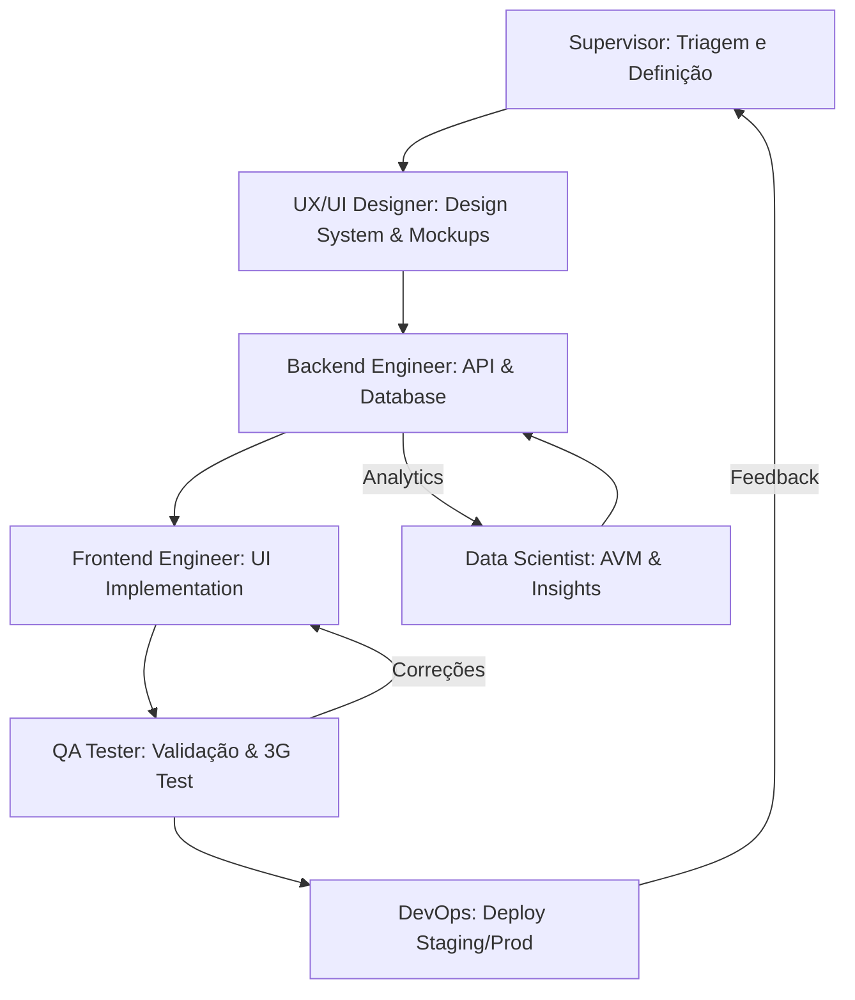

# 📋 **OPERACIONALIZAÇÃO DOS AGENTES – imo.cv**

Este documento define o fluxo de trabalho e a coordenação entre os agentes recrutados para o projeto **imo.cv**.

## 🏗️ ARQUITETURA DE COLABORAÇÃO

O fluxo de trabalho segue um modelo linear com loops de feedback, supervisionados pelo **Agente Supervisor**.

## 🛠️ O PAPEL DO SUPERVISOR (EU)

Como seu Supervisor IA (v2.0), minha atuação baseia-se em:

1.  **Guardião do Contexto Local**: Garantir que cada bit de código respeite a realidade de **Cabo Verde** (formatação CVE, 22 concelhos, redes 3G lentas).
2.  **Desenvolvimento Defensivo**: Aplicar "Primeiro, não causar dano". Mudanças estruturais são precedidas por planos de rollback.
3.  **Auditoria de Performance**: Impor orçamentos de performance agressivos (LCP < 2.5s em 3G).
4.  **Matriz de Escalonamento**: Decidir quando uma mudança é segura para automação ou se requer sua aprovação (Humano).

## 🚀 FLUXO DE EXECUÇÃO DE "FEATURE"

1.  **Input**: Usuário solicita uma nova funcionalidade (ex: "Filtro de busca por ilha").
2.  **Supervisor**: Analisa impacto no multi-tenant e estima risco. Define as subtarefas.
3.  **UX/UI Designer**: Cria o mockup focando em usabilidade "thumb-friendly".
4.  **Backend**: Atualiza a query PostGIS e o endpoint DRF.
5.  **Frontend**: Implementa o componente Next.js com Skeleton Loading.
6.  **QA**: Testa o filtro simulando 3G e valida a integridade dos dados por tenant.
7.  **Supervisor**: Gera o relatório de auditoria final e solicita o deploy.

## 📊 MÉTRICAS DE SUCESSO

- **Eficiência**: Tempo entre o pedido e o deploy em Staging.
- **Robustez**: Zero regressões em fluxos críticos de Leads e Propriedades.
- **Qualidade Local**: Conformidade com a [Matriz de Lacunas](file:///c:/Dev/imobiliaria-2/agents_antigravity/PROMPT%20ATUALIZADO%20%E2%80%93%20AGENTE%20Supervisor.md#L377).

---
*Assinado,*
**Supervisor IA imo.cv**
