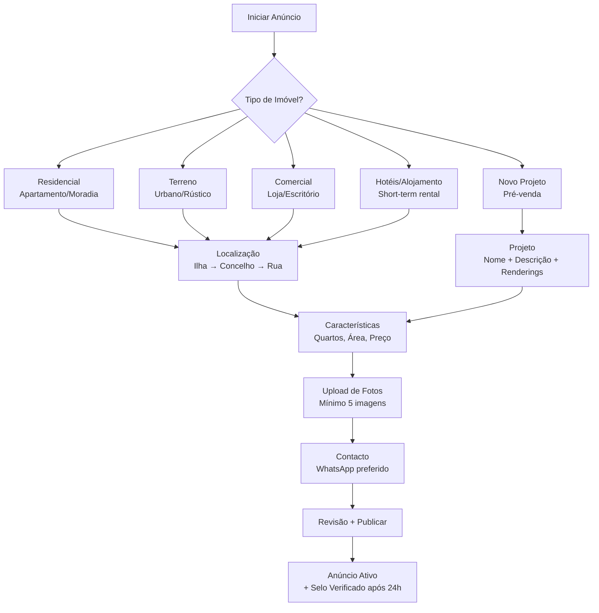

# 🏗️ ARQUITETURA LÓGICA DA PLATAFORMA IMO.CV – ORGANIZAÇÃO COMPLETA

## 🧭 VISÃO GERAL: 5 CAMADAS ORGANIZADAS

```
┌─────────────────────────────────────────────────────────────┐
│  CAMADA 1: MARKETPLACE PÚBLICO (imo.cv)                    │
│  → Para compradores, investidores, turistas                │
└─────────────────────────────────────────────────────────────┘
┌─────────────────────────────────────────────────────────────┐
│  CAMADA 2: CRM PARA AGENTES (subdomínio.agente.imo.cv)     │
│  → Para agentes imobiliários (gestão de leads + imóveis)   │
└─────────────────────────────────────────────────────────────┘
┌─────────────────────────────────────────────────────────────┐
│  CAMADA 3: MÓDULOS ESPECIALIZADOS                           │
│  → Arrendamento Férias | Novas Construções | Condomínios   │
└─────────────────────────────────────────────────────────────┘
┌─────────────────────────────────────────────────────────────┐
│  CAMADA 4: FERRAMENTAS FINANCEIRAS                          │
│  → Simulador crédito | Parcerias bancos | Seguros          │
└─────────────────────────────────────────────────────────────┘
┌─────────────────────────────────────────────────────────────┐
│  CAMADA 5: BACKOFFICE ADMIN (admin.imo.cv)                  │
│  → CMS completo para gestão da plataforma                  │
└─────────────────────────────────────────────────────────────┘
```

---

## 👥 HIERARQUIA DE UTILIZADORES E ACESSOS

| Role | Acesso | Permissões Principais |
|------|--------|------------------------|
| **Super Admin** | `admin.imo.cv` | Tudo: configuração global, gestão de tenants, billing, dados analytics |
| **Admin Plataforma** | `admin.imo.cv` | Gestão de agentes, verificação de imóveis, relatórios de mercado |
| **Promotor/Construtor** | `crm.imo.cv` | Módulo "Novas Construções", gestão de projetos, pré-vendas |
| **Agente Imobiliário** | `agencia.imo.cv` | CRM completo + publicação de imóveis residenciais/comerciais |
| **Gestor de Condomínio** | `condominio.imo.cv` | Módulo especializado de gestão de condomínios |
| **Proprietário Turístico** | `aluguer.imo.cv` | Módulo "Arrendamento Férias" para gestão de short-term rentals |
| **Particular** | `imo.cv/anunciar` | Formulário simplificado para anunciar 1 imóvel (sem CRM) |
| **Visitante** | `imo.cv` | Apenas pesquisa e contacto |

---

## 📋 ESTRUTURA LÓGICA DO BACKOFFICE (CMS ADMIN)

### **Dashboard Principal (`admin.imo.cv/dashboard`)**
```
┌─────────────────────────────────────────────────────────────┐
│  RESUMO EXECUTIVO (Super Admin)                             │
├───────────────┬───────────────┬───────────────┬─────────────┤
│  42 Agências  │  1.842 Imóveis│  287 Leads    │  €12.450 MRR│
│  Ativas       │  Ativos       │  Últimos 7d   │  Recorrente │
└───────────────┴───────────────┴───────────────┴─────────────┘

┌─────────────────────────────────────────────────────────────┐
│  MÓDULOS DE GESTÃO                                          │
├─────────────────────────────────────────────────────────────┤
│  🏢 AGÊNCIAS          → Aprovar/rejeitar novas agências     │
│  👤 UTILIZADORES      → Gerir roles e permissões            │
│  🏠 IMÓVEIS           → Verificar/analisar imóveis          │
│  💰 FATURAÇÃO         → Planos, pagamentos, cobranças       │
│  📊 ANALYTICS         → Relatórios de mercado por ilha     │
│  ⚙️ CONFIGURAÇÃO      → CMS: banners, textos, SEO           │
│  🔐 SEGURANÇA         → Logs de auditoria, atividade        │
└─────────────────────────────────────────────────────────────┘
```

### **Módulo de Gestão de Agentes (`admin.imo.cv/agencies`)**
```typescript
// Estrutura de dados para cada agência
interface AgencyAdminView {
  basicInfo: {
    name: string
    subdomain: string // ex: "praiaimoveis"
    status: 'pending' | 'active' | 'suspended' | 'deleted'
    createdAt: Date
    plan: 'free' | 'basic' | 'pro' | 'enterprise'
    billingStatus: 'active' | 'overdue' | 'cancelled'
  }
  
  verification: {
    documents: File[] // Escritura social, alvará
    verified: boolean
    verifiedAt: Date | null
    verifiedBy: User | null
  }
  
  performance: {
    activeProperties: number
    leadsLast30Days: number
    conversionRate: number // %
    averageResponseTime: number // minutos
    rating: number // 1-5
  }
  
  marketCoverage: {
    islands: string[] // ['Santiago', 'Sal']
    neighborhoods: string[]
  }
  
  actions: [
    'approve', 
    'suspend', 
    'delete', 
    'upgrade_plan', 
    'reset_password',
    'view_crm_dashboard' // entrar como admin no CRM da agência
  ]
}
```

---

## 🏢 CRM PARA AGENTES – FLUXO LÓGICO

### **Estrutura do Subdomínio (`agencia.imo.cv`)**
```
agencia.imo.cv/
├── dashboard/              # Resumo KPIs
├── properties/             # Gestão de imóveis
│   ├── list/              # Lista com filtros
│   ├── new/               # Publicar novo imóvel ✨
│   ├── edit/[id]/         # Editar imóvel
│   └── analytics/         # Estatísticas por imóvel
├── leads/                  # Gestão de leads
│   ├── pipeline/          # Kanban visual
│   ├── list/              # Lista detalhada
│   └── analytics/         # Taxa de conversão
├── clients/                # Base de dados de clientes
├── team/                   # Gestão de equipa (para agências grandes)
├── billing/                # Faturação e planos
└── settings/               # Configurações da agência
```

### **Fluxo de Publicação de Novo Imóvel (`agencia.imo.cv/properties/new`)**


---

## 🌴 MÓDULOS ESPECIALIZADOS – ORGANIZAÇÃO LÓGICA

### **1. Arrendamento para Férias (Turismo)**
```
URL: aluguer.imo.cv ou imo.cv/arrendamento-ferias

Público-alvo:
- Proprietários de imóveis turísticos
- Gestores de alojamento local
- Turistas à procura de curta duração

Funcionalidades específicas:
✅ Calendário de disponibilidade visual
✅ Preços sazonais (alta/baixa temporada)
✅ Integração com Airbnb/Booking.com (importação de reviews)
✅ Gestão de check-in/check-out
✅ Limpeza e manutenção (checklists)
✅ Taxas turísticas automáticas (Cabo Verde)
✅ Mínimo de noites por reserva

Tipologia no modelo de dados:
property_type: 'short_term_rental'
rental_type: 'daily' | 'weekly' | 'monthly'
seasonality: {
  high_season: { months: [12, 1, 2, 7, 8], multiplier: 1.5 },
  low_season: { months: [3, 4, 5, 6, 9, 10, 11], multiplier: 1.0 }
}
```

### **2. Novas Construções (Promotores)**
```
URL: construcao.imo.cv ou imo.cv/novas-construcoes

Público-alvo:
- Promotores imobiliários
- Construtores
- Investidores em pré-venda

Funcionalidades específicas:
✅ Fichas de projeto (não apenas unidades)
✅ Renderings 3D + planta interativa
✅ Fases de construção (fundação, estrutura, acabamentos)
✅ Unidades disponíveis em tempo real
✅ Reservas de unidades (pré-venda)
✅ Financiamento promotor (parceria com bancos)
✅ Documentação técnica (licenças, projetos)

Tipologia no modelo de dados:
property_type: 'new_development'
development: {
  name: string
  status: 'planning' | 'under_construction' | 'completed'
  completion_date: Date
  total_units: number
  available_units: number
  amenities: string[] // piscina, ginásio, estacionamento
}
units: Unit[] // array de unidades dentro do projeto
```

### **3. Gestão de Condomínios**
```
URL: condominio.imo.cv

Público-alvo:
- Administradores de condomínio
- Síndicos
- Moradores (área privada)

Funcionalidades específicas:
✅ Gestão de unidades (moradores, contactos)
✅ Quotas mensais + histórico de pagamentos
✅ Emissão automática de recibos
✅ Gestão de despesas comuns
✅ Reserva de áreas comuns (piscina, salão)
✅ Comunicação interna (avisos, assembleias)
✅ Votação digital para decisões
✅ Relatórios financeiros mensais/anos

Modelo de dados:
condominium: {
  name: string
  address: string
  total_units: number
  units: [{
    number: string
    owner: User
    tenants: User[]
    monthly_fee: number
    debt: number
  }]
  expenses: [{
    type: 'cleaning' | 'security' | 'maintenance' | 'utilities'
    amount: number
    date: Date
    description: string
  }]
}
```

---

## 💰 SIMULADOR DE CRÉDITO HABITAÇÃO

### **Localização Lógica na Plataforma**
```
Público: imo.cv/credito-habitacao (página pública acessível a todos)
Agente: agencia.imo.cv/tools/credit-simulator (versão avançada com tracking de leads)

Fluxo do utilizador:
1. Seleciona imóvel → Botão "Simular Financiamento"
2. Preenche 3 campos:
   - Rendimento mensal (CVE)
   - Entrada (% ou valor)
   - Prazo desejado (anos)
3. Recebe resultado instantâneo:
   - Valor financiável máximo
   - Prestação mensal estimada
   - Custo total com juros
4. Call-to-action:
   "Solicitar pré-aprovação" → Gera lead para banco parceiro
```

### **Integração com Bancos Parceiros**
```typescript
interface BankPartner {
  name: 'BCA' | 'BCN' | 'Ecobank' | 'Banco Interatlântico'
  logo: string
  interest_rate: number // % anual
  max_term: number // anos
  min_down_payment: number // % entrada mínima
  api_endpoint: string // para pré-aprovação automática
  commission: number // % do valor financiado (0.5-1%)
}

// Banco parceiro recebe lead com:
leadData = {
  property_id: string
  property_price: number
  applicant_income: number
  requested_amount: number
  requested_term: number
  applicant_contact: {
    name: string
    phone: string
    email: string
    nationality: 'cv' | 'pt' | 'other' // importante para diáspora
  }
}
```

---

## 🗂️ MODELO DE DADOS UNIFICADO – TIPOLOGIAS DE IMÓVEIS

```python
# models/properties.py
class Property(models.Model):
    # TIPOLOGIA PRINCIPAL (define o fluxo de publicação)
    TYPE_CHOICES = (
        ('residential', 'Residencial'),          # Apartamento, moradia, villa
        ('land', 'Terreno'),                     # Urbano, rústico
        ('commercial', 'Comercial'),             # Loja, escritório, armazém
        ('short_term_rental', 'Arrendamento Férias'),  # Alojamento local
        ('new_development', 'Nova Construção'),  # Projeto em pré-venda
        ('condominium_unit', 'Unidade Condomínio'), # Para módulo condomínios
    )
    property_type = models.CharField(max_length=50, choices=TYPE_CHOICES)
    
    # SUBTIPO (dentro de cada tipologia principal)
    SUBTYPE_CHOICES = {
        'residential': [
            ('apartment', 'Apartamento'),
            ('house', 'Moradia/Vivenda'),
            ('villa', 'Vila de Luxo'),
            ('studio', 'Estúdio'),
        ],
        'land': [
            ('urban', 'Terreno Urbano'),
            ('rustic', 'Terreno Rústico'),
            ('building_plot', 'Lote para Construção'),
        ],
        'commercial': [
            ('shop', 'Loja'),
            ('office', 'Escritório'),
            ('warehouse', 'Armazém'),
            ('restaurant', 'Restaurante'),
        ],
        'short_term_rental': [
            ('apartment_rental', 'Apartamento Turístico'),
            ('villa_rental', 'Vila para Férias'),
            ('guesthouse', 'Casa de Hóspedes'),
        ],
        'new_development': [
            ('residential_project', 'Projeto Residencial'),
            ('mixed_use', 'Projeto Misto (Residencial + Comercial)'),
            ('tourism_project', 'Projeto Turístico'),
        ],
    }
    
    property_subtype = models.CharField(max_length=50)
    
    # USO DO IMÓVEL (compra vs arrendamento)
    USAGE_CHOICES = (
        ('sale', 'Venda'),
        ('long_term_rental', 'Arrendamento Longo Prazo'),
        ('short_term_rental', 'Arrendamento Curto Prazo (Férias)'),
        ('pre_sale', 'Pré-venda (Nova Construção)'),
    )
    usage = models.CharField(max_length=50, choices=USAGE_CHOICES, default='sale')
    
    # DADOS ESPECÍFICOS POR TIPOLOGIA (JSON para flexibilidade)
    type_specific_data = models.JSONField(default=dict, blank=True)
    # Exemplos:
    # Para short_term_rental: { "min_nights": 3, "cleaning_fee": 2000, "seasonal_pricing": {...} }
    # Para new_development: { "project_name": "Marina Bay", "completion_date": "2026-12", "units_available": 45 }
    # Para condominium_unit: { "condominium_id": "uuid", "floor": 3, "parking_spots": 1 }
```

---

## 🧭 MAPA DE NAVEGAÇÃO LÓGICO PARA O UTILIZADOR

### **Visitante Comum (imo.cv)**
```
Homepage 
  → Pesquisar por ilha/tipo 
    → Lista de resultados 
      → Detalhe do imóvel 
        → Contactar agente (WhatsApp)
        → [Botão] "Simular Financiamento"
        → [Botão] "Ver Imóveis Semelhantes"
```

### **Agente Imobiliário (agencia.imo.cv)**
```
Dashboard
  ├── Imóveis
  │   ├── Listar todos
  │   ├── + Novo Imóvel → [Escolher tipologia] → Formulário específico
  │   └── Analytics
  ├── Leads
  │   ├── Pipeline Kanban
  │   └── Histórico
  ├── Clientes
  └── Ferramentas
      ├── Simulador Crédito (para usar com clientes)
      ├── AVM (estimativa de preço)
      └── Relatórios de Mercado
```

### **Promotor/Construtor (construcao.imo.cv)**
```
Dashboard de Projetos
  ├── Meus Projetos
  │   ├── + Novo Projeto
  │   ├── Unidades Disponíveis
  │   └── Reservas/Pré-vendas
  ├── Ferramentas
  │   ├── Renderings 3D
  │   ├── Planta Interativa
  │   └── Documentação Técnica
  └── Parcerias
      ├── Bancos (financiamento promotor)
      └── Construtores
```

### **Gestor de Condomínio (condominio.imo.cv)**
```
Dashboard do Condomínio
  ├── Unidades
  │   ├── Lista de Moradores
  │   └── Histórico de Pagamentos
  ├── Finanças
  │   ├── Quotas Mensais
  │   ├── Despesas Comuns
  │   └── Relatórios
  ├── Gestão
  │   ├── Áreas Comuns (reservas)
  │   ├── Avisos/Comunicações
  │   └── Votações
  └── Documentos
      ├── Atas de Assembleia
      └── Regulamento Interno
```

---

## ⚙️ IMPLEMENTAÇÃO TÉCNICA – ARQUITETURA DE MÓDULOS

### **Estrutura de Pastas no Backend (Django)**
```
backend/
├── apps/
│   ├── core/               # Autenticação, tenants, configuração global
│   ├── marketplace/        # Imóveis, pesquisa, detalhes públicos
│   ├── crm/                # Leads, pipeline, clientes
│   ├── agencies/           # Gestão de agências (CRUD + verificação)
│   ├── short_term_rental/  # Módulo especializado para turismo ⭐
│   ├── new_developments/   # Módulo para promotores ⭐
│   ├── condominiums/       # Módulo de gestão de condomínios ⭐
│   ├── financing/          # Simulador + integração bancos ⭐
│   └── admin_portal/       # Backoffice CMS completo ⭐
└── templates/
    ├── public/             # Templates públicos (imo.cv)
    ├── agency/             # Templates CRM agente
    ├── admin/              # Templates backoffice
    └── modules/            # Templates módulos especializados
```

### **Estrutura de Rotas no Frontend (Next.js)**
```
frontend/
├── app/
│   ├── (public)/           # Rotas públicas
│   │   ├── page.tsx        # Homepage
│   │   ├── property/[id]/page.tsx
│   │   └── credito-habitacao/page.tsx  # Simulador público ⭐
│   ├── (agency)/           # Rotas protegidas agente
│   │   └── [subdomain]/
│   │       ├── dashboard/page.tsx
│   │       ├── properties/
│   │       │   ├── page.tsx
│   │       │   └── new/page.tsx        # Formulário dinâmico por tipologia ⭐
│   │       └── leads/page.tsx
│   ├── (admin)/            # Backoffice CMS ⭐
│   │   └── admin/
│   │       ├── dashboard/page.tsx
│   │       ├── agencies/page.tsx
│   │       └── settings/page.tsx
│   ├── short-term-rental/  # Módulo turismo ⭐
│   ├── new-developments/   # Módulo promotores ⭐
│   └── condominiums/       # Módulo condomínios ⭐
```

---

## ✅ CHECKLIST DE IMPLEMENTAÇÃO PRIORITÁRIA

### **Fase 1 (MVP – 3 meses)**
- [ ] Backoffice básico (`admin.imo.cv`) com gestão de agências
- [ ] CRM para agentes com publicação de imóveis residenciais
- [ ] Detalhe de imóvel público funcional
- [ ] Simulador de crédito básico (cálculo estático)
- [ ] Modelo de dados unificado com tipologias

### **Fase 2 (Pós-MVP – 3 meses)**
- [ ] Módulo "Arrendamento Férias" completo
- [ ] Módulo "Novas Construções" para promotores
- [ ] Simulador avançado com integração bancária
- [ ] Backoffice CMS completo (banners, SEO, textos editáveis)

### **Fase 3 (Escala – 6 meses)**
- [ ] Módulo "Gestão de Condomínios" completo
- [ ] API pública para parceiros (bancos, avaliadores)
- [ ] Relatórios de mercado automáticos por ilha
- [ ] Integração com portais de turismo (Airbnb, Booking)

---

## 💡 DICA ESTRATÉGICA PARA CABO VERDE

**Priorize esta ordem de lançamento:**
1. **Primeiro:** CRM básico + Marketplace (resolver problema imediato de fragmentação)
2. **Segundo:** Arrendamento Férias (turismo é motor económico de CV – Sal, Boa Vista)
3. **Terceiro:** Novas Construções (crescimento imobiliário em Praia, Sal)
4. **Quarto:** Gestão de Condomínios (mercado mais maduro, requer confiança estabelecida)
5. **Quinto:** Simulador com bancos (requer volume de leads para negociar parcerias)

**Porquê esta ordem?**
- Turismo gera receita rápida (short-term rentals têm ticket alto)
- Novas construções atraem promotores com poder de decisão
- Condomínios são "stickier" (retenção alta) mas requerem base instalada
- Bancos só se interessam quando tens volume de leads qualificados

Esta arquitetura lógica mantém a plataforma **escalável, modular e adaptada ao contexto cabo-verdiano**, com cada módulo podendo evoluir independentemente sem quebrar a experiência global. 🌴🚀